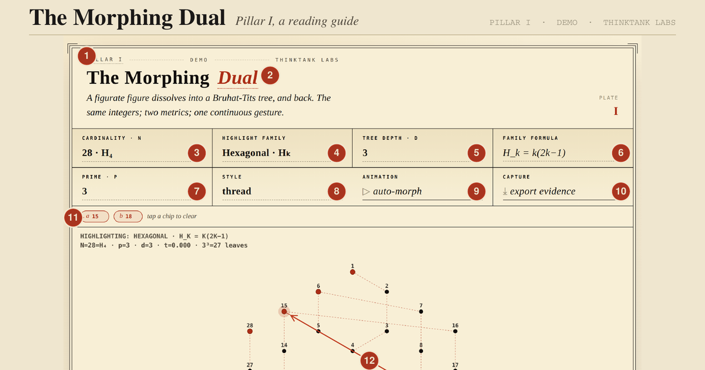

# The Morphing Dual

A live, interactive visualization of the duality between figurate numbers and Bruhat-Tits trees. The same finite set of integers, measured two different ways: Euclidean (geometric) on one side, p-adic (number-theoretic) on the other. A slider continuously morphs between the two views.

**[Open the live demo →](https://jaredm-research.github.io/morphing_dual_demo/)**



## What you can do with it

- Pick a figurate family (triangular, pentagonal, hexagonal, centered hexagonal, star) and watch the dot-figure assemble
- Choose a prime *p* (2, 3, 5, or 7) and a tree depth *d* (1 to 4) to define the p-adic side
- Tap two integers; the panel below reports |a − b|, v_p(a − b), |a − b|_p, and the depth at which their tree-paths diverge
- Drag the morph slider to dissolve the geometric figure into its p-adic residue tree, and back
- Export a paired evidence package: a high-resolution PNG of what's on screen, and a JSON manifest with every parameter, every dot's leaf assignment, and a SHA-256 hash for integrity verification

A two-page reading guide explains every feature: see [`assets/morphing_dual_reading_guide.pdf`](assets/morphing_dual_reading_guide.pdf).

## What this is

This is **Pillar I** of a planned seven-pillar exposition of the figurate ↔ p-adic dual. The artifact is a single self-contained HTML file. No build step, no installation, no server: open it in any modern browser, online or off.

The mathematics is well-established (Bruhat-Tits 1972, Serre's *Trees*, the figurate-number literature). What this artifact contributes is the *interactive duality* itself: the same integers live in both metrics simultaneously, and you can watch the geometric structure of one face become the residue-class structure of the other.

## Repository

This repository hosts the public demo only — a single HTML file plus this
documentation. Active development happens in a private repository where
the full test suite, audit infrastructure, mathematical specification,
and seven-pillar roadmap live. If you'd like to discuss the work,
collaborate, or cite it, the contact details are in `LICENSE` and `NOTICE`.

## License

Apache 2.0. See [`LICENSE`](LICENSE) for the full text and [`NOTICE`](NOTICE)
for what is and is not copyrighted in this work (the code is mine; the
mathematics is in the public domain; the seven-pillar exposition framework
is mine as a work of authorship).

## Citation

```
McCullough, J. (2026). The Morphing Dual — Pillar I.
https://jaredm-research.github.io/morphing_dual_demo/
```

A `CITATION.cff` file is available on request.